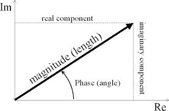
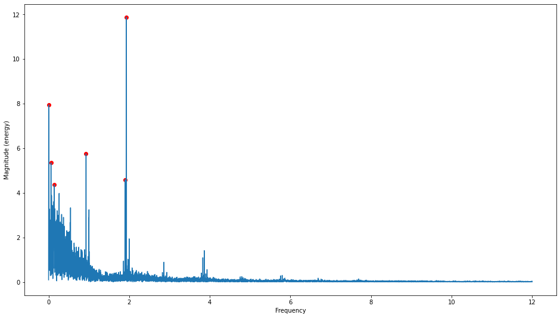
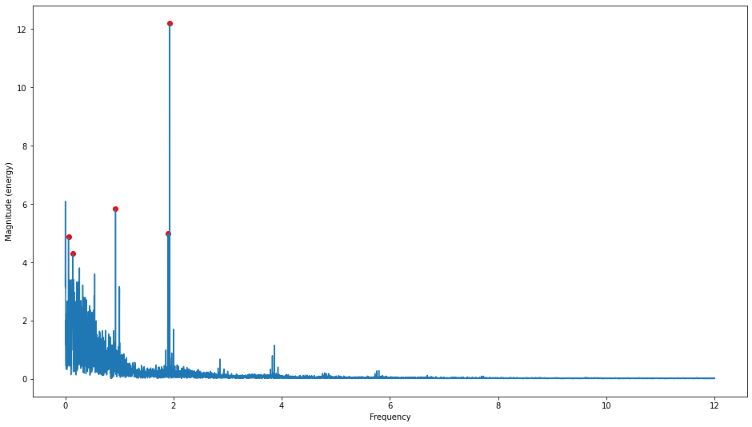
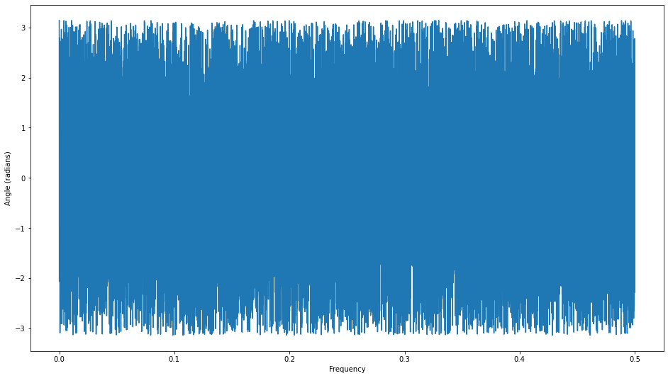

[Contenidos](../Contenidos.md) \| [Anterior (4 Introducción a Pandas)](04_Pandas_basico.md) \| [Próximo (6 Cierre de la séptima)](06_Cierre.md)

# 7.5 Detección de patrones periódicos

## Tema Optativo: Series temporales

Autores: [Octavio Bruzzone](https://inta.gob.ar/personas/bruzzone.octavio) y Rafael Grimson

* Octavio da dos cursos de posgrado sobre Series Temporales (uno centrado en  Análisis del dominio del Tiempo y el otro en el dominio de las Frecuencias)


Para comenzar, copiate [el archivo](./OBS_SHN_SF-BA.csv) con datos de mareas en los puertos de San Fernando y Buenos Aires a tu carpeta 'Datos/'

En este práctico vamos a visualizar y analizar datos de mareas.


## Lectura de archivos temporales


```python
import pandas as pd

df=pd.read_csv('Data/OBS_SHN_SF-BA.csv')
```

Observá los datos:
    
```python
df.head()
df.tail()

df.index
```

Este archivo tiene alturas del agua en el puerto de San Fernando (columna 'H_SF') y en el puerto de Buenos Aires (columna 'H_BA') medidas en centímetros.
Tiene un dato por hora durante (columna 'Time') cuatro años.
Como suele pasar con este tipo de archivos, tiene muchos datos faltantes.

No es del todo razonable que el índice de esta DataFrame sea un simple rango numérico. 
El índice debería ser el instante en le que se tomó cada muestra ('Time'). 
Para esto tenemos que decirle a la función `read_csv` dos cosas: 
por una lado que use la columna 'Time' como índice (index_col=['Time']) 
y por el otro que la interprete como un timestamp (parse_dates=True).


```python
df=pd.read_csv('Data/OBS_SHN_SF-BA.csv',index_col=['Time'],parse_dates=True)
```

Observá la diferencia:
    
```python
df.head()
df.tail()

df.index
```

Que el índice sea temporal nos da una versatilidad genial para trabajar con estos datos.
Probá por ejemplo los siguientes comandos:
    
```python
df['1-18-2014 9:00':'1-18-2014 18:00']
df['2-19-2014'] #observá que el formato de fechas que se usa es el de USA
df['12-25-2014':]
```

## Mareas en el Río de la Plata

Grafiquemos estos últimos datos:
    
```python
df['12-25-2014':].plot()
```

Aca se ven tres fenómenos interesantes: 
* Hay 14 picos en 7 días, esto corresponde a la frecuencia _semidiurna_ de las mareas. 
Cada 12hs aproxiamdamente tenemos un ciclo con pleamar y bajamar. Dos ciclos por día.
* Por otra parte, se ve que las mareas en San Fernando están retrasadas respecto a las de Buenos Aires. 
Esto se debe a que las ondas de marea vienen del mar atlántico y se propagan por el estuario del rio de la Plata, 
pasando primero por Buenos Aires y llegando luego, con retraso, a San Fernando.
* Finalmente, se ve que la altura en San Fernando está por encima de la de Buenos Aires. Esto se debe a que las escalas con las que se registran los datos no tiene un cero comun bien calibrado.

## Tormentas y sudestadas en el Río de la Plata

Si miramos un gráfico un poco más extendido en el tiempo vamos a ver que las alturas no solo fluctuan con las mareas semidiurnas sino que la componente meteorológica (vientos principalmente) modifican las alturas de manera muy considerable.

Esto genera un gráfico entre el 15 de octubre de 2014 y el 15 de diciembre del mismo año. 
```python
df['10-15-2014':'12-15-2014'].plot()
```
Se puede observar cómo una sudestada a principios de noviembre elevó el nivel del estuario más de un metro durante casi tres días.


### Ejercicio 7.8: 
Trabajemos con una copia de este fragmento:

```python
dh=df['12-25-2014':].copy()
```

Podemos desplazar (shift en inglés) una serie temporal usando el método `ds.shift(pasos)`. Podemos subir o bajar su gráfico sumando una constante a todas las mediciones `ds + cte`.

Finalmente podemos unir dos series en un en un DataFrame de manera muy simple, para poder graficarlas juntas. Si concatenamos estas operaciones obtenemos algo así:

```python
delta_t = 0 #tiempo que tarda la marea entre ambos puertos
delta_h = 0 #diferencia de los ceros de escala entre ambos puertos
pd.DataFrame([dh['H_SF'].shift(delta_t)-delta_h,dh['H_BA']]).T.plot()
```

Buscá los valores de `delta_t` (entero, son pasos) y `delta_h` (puede tener decimales, es un float) que hacen que los dos gráficos se vean lo más similares posible.

En lo que sigue vamos a usar herramientas matemáticas para hacer un análisis similar al que hicimos a mano en el ejercicio anterior pero de una manera menos *artesanal*. En particular vamos a hacer un análisis por medio de la transformada de Fourier. El desplazamiento horizontal corresponde a una diferencia de fase y el desplazamiento vertical es simplente una contante aditiva. Veamos cómo se hace esto.

## Análisis por medio de transformadas de Fourier

La transformada de Fourier descompone una señal en una suma de senos y cosenos (sinusoides) con diferentes frecuencias y amplitudes.

Este gráfico ilustra el proceso de la tranformada de Fourier de una forma bastante intuitiva.


La transofrmada da, para cada frecuencia, un número complejo `a + bi` que puede pensarse como un vector `(a,b)` en el plano. La parte real va a multiplicar un coseno con la frecuencia indicada y la parte imaginaria un seno con la misma frecuencia. La magnitud (o amplitud, o potencia) de la señal en esa frecuencia se corresponde con el largo del vector `(a,b)`.



La fase (o desplazamiento del máximo respecto del origen de las coordenadas), se corresponde con ángulo que forma este vector `(a,b)` con el semieje de los reales positivos.


### Fast fourier transform en Python

Vamos a usar los siguientes módulos:

```python
#importo modulos para procesar señales
from scipy import signal
from scipy import fftpack, fft
```

Primero vamos a eliminar 

```python
#se le quita la tendencia a la serie
sdt0 = detrend_linear(serie[:,0])
#espectro de potencia (amplitud de los sinusoides)
#parametros: serie de datos y frecuencia de muestreo (24/dia)
(mg0, frc0, linea0) = magnitude_spectrum(sdt0, 24.)
#se buscan lospicos del espectro de potencia
picos0 = signal.find_peaks(mg0, prominence=4, distance = 10)[0]
#verificar los picos con un print
#se ve la prominencia de ser necesario
#print(signal.peak_prominences(mg0, picos0))
#se grafican los picos como circulitos rojos
scatter(frc0[picos0], mg0[picos0], facecolor='r')
show()
#idem para la segunda serie
sdt1 = detrend_linear(serie[:,1])
(mg1, frc1, linea1) = magnitude_spectrum(sdt1, 24.)
picos1 = signal.find_peaks(mg1, prominence=4, distance = 10)[0]
#print(signal.peak_prominences(mg1, picos1))
scatter(frc1[picos1], mg1[picos1], facecolor='r')
show()
```








```python
set_printoptions(precision=4,suppress=True,linewidth=180)
#se obtiene elespectro de angulos
#parametros: serie de datos y frecuencia de muestreo (1/hora o 24/dia)
ang0, frec0, lin0 = angle_spectrum(sdt0, 24.)
#vemos la fase de los picos en horas
print("Frecuencia",frec0[picos0])
print("Angulo",ang0[picos0] / (2 * pi) * 1/frec0[picos0])
show()
ang1, frec1, lin1 = angle_spectrum(sdt1, 24.)
print("Frecuencia",frec1[picos1])
print("Angulo",ang1[picos1] / (2 * pi) * 1/frec1[picos1])
show()
#ver la diferencia de fase entre los picos de la misma frecuencia
```

    Frecuencia [0.0024 0.06   0.1404 0.93   1.896  1.932 ]
    Angulo [-137.1708    6.7523    3.5428   -0.4326   -0.0325   -0.0334]


    Frecuencia [0.06   0.1404 0.93   1.896  1.932 ]
    Angulo [ 7.0631 -3.5528 -0.402   0.0014 -0.0031]


```python
#hacer lo mismo con la frecuencia en días
ang0, frec0, lin0 = angle_spectrum(sdt0, 1.)
#vemos la fase de los picos en horas
print(ang0[picos0] / (2 * pi) * 1/frec0[picos0])
show()
ang1, frec1, lin1 = angle_spectrum(sdt1, 1.)
print(ang1[picos1] / (2 * pi) * 1/frec1[picos1])
show()
```

    [-3292.0991   162.0544    85.0273   -10.3817    -0.7797    -0.8008]





    [169.5149 -85.2664  -9.6469   0.0325  -0.0749]


```python
#ejemplo importado de la documentación de matplotlib

import matplotlib.pyplot as plt
import numpy as np


np.random.seed(0)

dt = 0.01  # sampling interval
Fs = 1 / dt  # sampling frequency
t = np.arange(0, 10, dt)

# generate noise:
nse = np.random.randn(len(t))
r = np.exp(-t / 0.05)
cnse = np.convolve(nse, r) * dt
cnse = cnse[:len(t)]

s = 0.1 * np.sin(4 * np.pi * t) + cnse  # the signal

fig, axs = plt.subplots(nrows=3, ncols=2, figsize=(7, 7))

# plot time signal:
axs[0, 0].set_title("Signal")
axs[0, 0].plot(t, s, color='C0')
axs[0, 0].set_xlabel("Time")
axs[0, 0].set_ylabel("Amplitude")

# plot different spectrum types:
axs[1, 0].set_title("Magnitude Spectrum")
axs[1, 0].magnitude_spectrum(s, Fs=Fs, color='C1')

axs[1, 1].set_title("Log. Magnitude Spectrum")
axs[1, 1].magnitude_spectrum(s, Fs=Fs, scale='dB', color='C1')

axs[2, 0].set_title("Phase Spectrum ")
axs[2, 0].phase_spectrum(s, Fs=Fs, color='C2')

axs[2, 1].set_title("Angle Spectrum")
axs[2, 1].angle_spectrum(s, Fs=Fs, color='C2')

axs[0, 1].remove()  # don't display empty ax

fig.tight_layout()
plt.show()
```


```python

```


[Contenidos](../Contenidos.md) \| [Anterior (4 Introducción a Pandas)](04_Pandas_basico.md) \| [Próximo (6 Cierre de la séptima)](06_Cierre.md)

