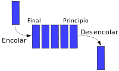

[Contenidos](../Contenidos.md) \| [Anterior (3 Métodos especiales)](03_Métodos_Especiales.md) \| [Próximo (5 Ejercicios de objetos inspirados en Lotka Volterra)](05_Ejs_OOP_Volterra.md)

# 8.4 Ejercicios de objetos

En esta sección tendrás que resolver algunos ejercicios definiendo clases y objetos.

### Algun ej geométrico?
Un cuadrado datos por dos vertices con herencia?


### Ejercicio 8.11: Torre de Control
Una **cola** es una estructura de datos. Se caracteriza por contener una secuencia de elementos y dos operaciones: encolar y desencolar. La primera, encolar, agrega un elemento al final de la secuencia que contiene la cola. Desencolar, por su parte, devuelve el primer elemento de la secuencia y lo elimina de la misma. 

Las colas también se llaman estructuras FIFO (del inglés First In First Out), debido a que el primer elemento en entrar a la cola será también el primero en salir. El nombre cola se le da por su analogía con las colas que hacemos (o hacíamos cuando podíamos salir de casa) para entrar al cine, por ejemplo.



Aquí abajo damos una implementación de la clase `Cola`. Usándo un par de objetos de estas clase como atributos, escribí una nueva clase llamada `TorreDeControl` que modele el trabajo de una torre de control de un aeropuerto con una pista de aterrizaje. Los aviones que están esperando para aterrizar tienen prioridad sobre los que están esperando para despegar. La clase debe funcionar conforme al siguiente ejemplo:

```python
>>> torre = TorreDeControl()
>>> torre.nuevo_arribo('AR156')
>>> torre.nueva_partida('KLM1267')
>>> torre.nuevo_arribo('AR32')
>>> torre.ver_estado()
Vuelos esperando para aterrizar: AR156, AR32
Vuelos esperando para despegar: KLM1267
>>> torre.asignar_pista()
El vuelo AR156 aterrizó con éxito.
>>> torre.asignar_pista()
El vuelo AR32 aterrizó con éxito.
>>> torre.asignar_pista()
El vuelo KLM1267 despegó con éxito.
>>> torre.asignar_pista()
No hay vuelos en espera.
```

Esta es la implementación que damos de la clase Cola:
```python
class Cola:
    '''Representa a una cola, con operaciones de encolar y desencolar.
    El primero en ser encolado es tambien el primero en ser desencolado.
    '''

    def __init__(self):
        '''Crea una cola vacia.'''
        self.items = []

    def encolar(self, x):
        '''Encola el elemento x.'''
        self.items.append(x)

    def desencolar(self):
        '''Elimina el primer elemento de la cola 
        y devuelve su valor. 
        Si la cola esta vacia, levanta ValueError.'''
        if self.esta_vacia():
            raise ValueError('La cola esta vacia')
        return self.items.pop(0)

    def esta_vacia(self):
        '''Devuelve 
        True si la cola esta vacia, 
        False si no.'''
        return len(self.items) == 0
```

Guardá tu solución conteniendo la definición de la clase `Cola` en `torre_control.py` para entregar.


### Ejercicio 8.12: Canguros buenos y canguros malos
Este ejercicio está relacionado con un error muy común en Python. Escribí una definición de una clase `Canguro` que tenga:

*  Un método `__init__` que inicializa un atributo llamado `contenido_marsupio` como una lista vacía.
* Un método llamado `meter_en_marsupio` que, dado un objeto cualquiera, lo agregue a la lista `contenido_marsupio`.
* Un método `__str__` que devuelve una representación como cadena del objeto `Canguro` y de los contenidos de su marsupio.

* Probá tu código creando dos objetos, `madre_canguro` y `cangurito` y guardá en el marsupio de la madre algunos objetos y al cangurito. 
* Luego, mirá el ejemplo `CanguroMalo.py` copiado a continuación. Este ejemplo tiene un bug. Analizalo, corregilo. Entregá como respuesta un archivo `CangurosBuenos.py` conteniendo, perimero la clase definida por vos y luego una corrección de la clase definida en el ejemplo, junto con un comentario indicando dónde estaba el error y en qué constía.
* 
```python
# CanguroMalo.py
"""Este código continene un 
bug importante y dificil de ver
"""

class Canguro:
    """Un Canguro es un marsupial."""
    
    def __init__(self, nombre, contenido=[]):
        """Inicializar los contenidos del marsupio.

        nombre: string
        contenido: contenido inicial del marsupio, lista.
        """
        self.nombre = nombre
        self.contenido_marsupio = contenido

    def __str__(self):
        """devuelve una representación como cadena de este Canguro.
        """
        t = [ self.nombre + ' tiene en su marsupio:' ]
        for obj in self.contenido_marsupio:
            s = '    ' + object.__str__(obj)
            t.append(s)
        return '\n'.join(t)

    def meter_en_marsupio(self, item):
        """Agrega un nuevo item al marsupio.

        item: objecto a ser agregado
        """
        self.contenido_marsupio.append(item)

#%%
madre_canguro = Canguro('Madre')
cangurito = Canguro('gurito')
madre_canguro.meter_en_marsupio('billetera')
madre_canguro.meter_en_marsupio('llaves del auto')
madre_canguro.meter_en_marsupio(cangurito)

print(madre_canguro)

# Al ejecutar este código todo parece funcionar correctamente.
# Para ver el problema, imprima el contenido de cangurito
```

### Ejercicio 8.13: Instrumento de escritura de Oski
Definí una clase `Papel` que contenga un atributo `texto`, un método
`escribir()` que reciba una cadena para agregar al `texto`, y otro método
`__str__` que devuelva el contenido del texto.

* Definí una clase `InstrumentoDeEscritura` que contenga un atributo `cantidad_de_tinta`, y un método `escribir()` que reciba un texto y un papel sobre el cual escribir y escriba. Cada caracter escrito debe reducir en uno la cantidad de tinta disponible. Si la cantidad de tinta es cero, el método `escribir()` no agrega texto y levanta una excepción `SinTinta`. Por último, implementá un método  `tiene_tinta()` que devuelve `True` si el instrumento  tiene tinta disponible.

* Definí una clase `Marcador` derivada de la clase `InstrumentoDeEscritura`, que herede sus métodos y agregue el método `recargar()`, que reciba una cantidad cualquiera de tinta a agregar.

* Definí una clase `Pluma` derivada de `InstrumentoDeEscritura`, que herede sus métodos y agregue el método `recargar()`. Cuidado que la tinta para plumas viene en cartuchos de 100cm3.

* Definí una clase `Plumin` derivada de `InstrumentoDeEscritura`, que herede sus métodos y agregue el método `recargar()`. Los plumines se recargan en el tintero llegando siempre a 7cm3 de tinta.

Para usar el papel y los instrumentos de escritura, escribí un pequeño programa, que tome dos ó tres páginas de texto (por ejemplo el Quijote tomado de la Clase 05) y lo escriba sobre un papel utilizando un instrumento por página (una página son unas 500 palabras), y que sea capaz de recargar tinta en los instrumentos y mostrar el texto finalmente escrito. Calibre los tamaños de las recargas y el consumo de tinta por letra para cada instrumento para estar obligado a cargar tinta al menos una vez con cada uno.


[Contenidos](../Contenidos.md) \| [Anterior (3 Métodos especiales)](03_Métodos_Especiales.md) \| [Próximo (5 Ejercicios de objetos inspirados en Lotka Volterra)](05_Ejs_OOP_Volterra.md)

